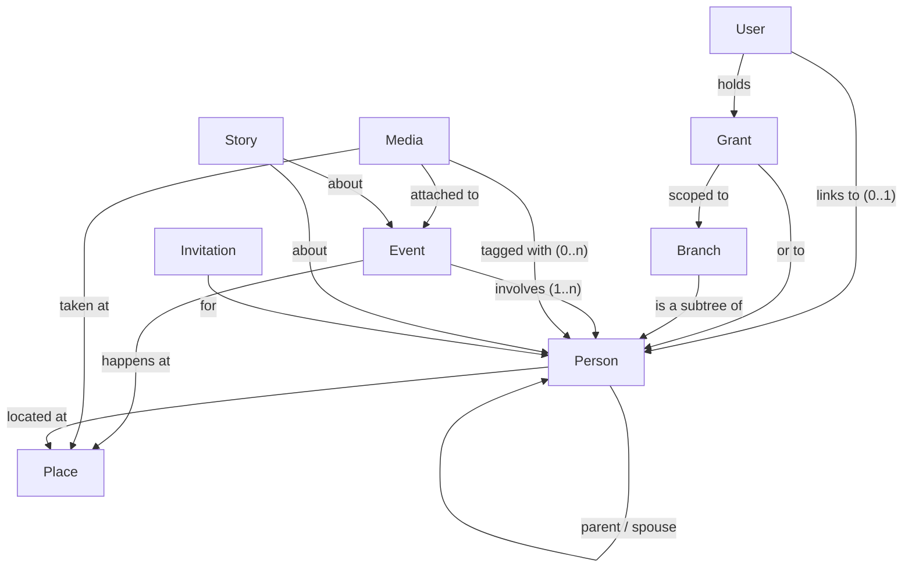

# Stage 2 — Domain Mapping

> A conceptual model of Bonzai's problem space — the nouns, relationships, verbs, and tensions.
> **Not** a database schema (that's [Stage 3](../03-data-model/)). Status: 🟢 validated (2026-07-02).
> Related: [[vision-anchor]] · [[README]].

## 1. The nouns

Grouped by the sub-domain they belong to.

### People & structure
- **Person / Node** — a human represented in the tree. May or may not be linked to a **User
  account**. Living or deceased. The atom everything else hangs off.
- **Relationship** — a tie between two Persons. Today: `parent`, `spouse`. Candidate additions to
  weigh in Stage 3: unmarried partner, adoptive/step, sibling (or keep siblings *derived* from
  shared parent, as today).
- **Branch** — a *subtree* of the family used as the unit of curation authority (e.g. "my cousin's
  branch"). **Definition is an open question** — see Tensions §5. This noun exists because of the
  permission model, not because families naturally think in strict subtrees.
- **Family (the tree)** — the single shared dataset. Assumption: **one family tree per Bonzai
  instance** (this family), not a multi-family platform. Revisit only if pull emerges beyond the
  family.

### Accounts & authority
- **User account** — a login. Linked to *at most one* Person node (and a Person has at most one
  User).
- **Role / grant** — authority a User holds: **Super Admin** (everything), **Branch Admin** (edit
  unlinked nodes within a scoped branch), **Node Admin** (edit one specific user-less node),
  **Member** (explore + maintain own node/media). Grants are *scoped* (global / branch / node).
- **Invitation** — the mechanism a Super/Branch Admin uses to bring a relative in and (optionally)
  link them to an existing node.
- **Access request** — a Member asking a Super Admin for an edit or for expanded authority.

### View content (the four lenses over the same people)
- **Event** — a dated happening. Two flavors to reconcile in Stage 3: **individual life events**
  (birth, death, marriage, graduation, service, moves) and **shared family events** (a reunion, a
  trip). An event may involve **one or many** Persons. Feeds the **timeline** view.
- **Place / Location** — a geographic spot. Semantics to pin down (Tensions §7): a Person's
  *current residence*, a *birthplace*, an *event location*, or "where a branch lives." Feeds the
  **map** view.
- **Media** — an uploaded photo (video later?). Has a caption, an uploader, an optional date, and
  **tagged Persons**; may attach to an Event and/or a Place. Feeds the **gallery** view.
- **Story / Note** — freeform narrative about a Person or Event (the "stories" from the vision).
  Open: first-class **Story** entity vs. a `notes` field on Person/Event (Stage 3).

### Social / cross-cutting (vision-level; likely post-MVP)
- **Comment / reaction** — the lightweight social layer that serves "deepen connection."
- **Tag / mention** — links Media and Stories to the Persons they depict/reference.
- **Authorship & timestamps** — who added/changed what, and when (needed for both trust and the
  timeline of the app's own growth).

## 2. Relationships between the nouns

The through-line: **Person is the hub.** Relationships, grants, events, media, stories, and places
all connect back to people. The four views are four projections of this one graph.

## 3. Concrete scenarios (walk the domain end-to-end)

1. **Bootstrap.** Founder + brother (Super Admins) create the tree: add parents, grandparents,
   themselves, spouses, kids. They link their own accounts to their nodes and invite a first wave
   of cousins.
2. **A cousin expands their branch.** Cousin Maria accepts an invite, links to her node, and adds
   her spouse, her two kids, and her deceased father — all *within her branch*. She uploads a photo
   of her kids and tags them. She tries to edit the founder's grandmother's birthplace → **not
   permitted** (outside her branch); she files an access request instead.
3. **Reunion moment.** At the reunion, an aunt without an account is handed a phone; someone with
   authority adds her on the spot, tags her into three group photos, and drops a pin on the map for
   where she lives now.
4. **A branch with no curator.** A cousin's line is out of contact. A Super Admin grants Maria
   **Branch Admin** over that branch so she can maintain it on their behalf.
5. **Exploring after the reunion.** Grandpa (linked member) opens the **timeline** and sees every
   birth, marriage, and move in chronological order; switches to the **map** to see where everyone
   is; opens the **gallery** filtered to a single grandchild; taps a face in a photo to jump to
   that person's node in the **graph**.

## 4. The verbs (candidate journeys → feed Stage 5)

- **Onboarding/accounts:** sign up, accept invitation, link account to a node, request access/role.
- **Tree:** add person, edit person, link/unlink relationship, merge duplicates, mark deceased,
  grant Branch/Node Admin, define branch scope.
- **Events:** add event, edit event, attach people / place / media to it.
- **Places:** set a person's location, place an event on the map.
- **Media:** upload photo, tag people, caption, attach to event/place.
- **Stories:** write a story/note about a person or event.
- **Explore:** view graph, timeline, map, gallery; open a person profile; filter/scope to a branch;
  jump between views on the same person.
- **Social (vision):** comment, react, mention.
- **Share/privacy:** invite a relative, set visibility, request an edit.

## 5. Tensions (where the architecture needs flexibility)

1. **Curation integrity vs. participation.** The whole family should contribute, but the tree's
   structure shouldn't be freely editable by everyone. → Resolved *in principle* by branch-scoped
   roles; the mechanics are Stage 4.
2. **Linked vs. unlinked persons.** A Person is a data node *and possibly* an account holder — two
   identities that must stay cleanly separable (you can edit a node before its owner ever logs in;
   an owner joining shouldn't fork their record).
3. **One dataset, four views.** Every entity must serve graph/timeline/map/gallery without
   duplication. If a view needs data no entity holds, the model has a gap (stress-test in Stage 3).
4. **Private vs. easy to join.** "Beautiful & private" (invite-only) vs. wanting relatives to join
   effortlessly at a chaotic reunion. Also: is *everything* visible to every member, or is
   visibility itself branch-scoped?
5. **What is a "branch"? (the crux).** Permission scoping needs a precise definition, and families
   aren't clean subtrees:
   - A **marry-in spouse** bridges two families — whose branch are they in?
   - A **child of two branches** (parents from different lines) belongs to both — who may edit them?
   - Is a branch defined *relative to a pivot person* (that person + their descendants? + ancestors?
     + spouses?), or is it a named group people are assigned to?
   This directly gates the permission model and must be nailed in Stage 3/4.
6. **Local-first scaffold vs. multi-user vision.** Today's `localStorage` single-editor store
   cannot express accounts, roles, or sharing. The four-view multi-user vision needs real
   accounts + a synced backend. → Headline Stage 4 decision.
7. **Location has many facets over time.** Birthplace ≠ current residence ≠ where an event
   happened; a person's location changes across life. Is "location" a single field, a history, or
   always mediated through Events? (Stage 3.)
8. **Events: one person vs. many.** A birth touches one person; a marriage two; a reunion dozens.
   The Event↔Person link is many-to-many, and roles differ (subject vs. attendee).
9. **Sensitive data.** Living vs. deceased, and minors, may need different visibility/consent
   handling — bears on privacy (Stage 4).

## Resolved domain decisions (2026-07-02)

- **Events → one flexible `Event` entity** + an `EventParticipant` join with roles. Individual vs.
  shared is expressed by participant count, not by structure (birth = 1, marriage = 2, reunion =
  N). One timeline source, one code path.
- **Location → shared `Place` entity + per-person residence history.** Reusable Places (name +
  coords) referenced by people, events, and media; a Person has *many* residences over time
  (supports migration storytelling on the map).
- **Stories → a rich `notes` field** on Person and Event, **not** a first-class entity for now. A
  dedicated Story entity is a post-MVP possibility, not built now.
- **Relationships → full kinship set.** Beyond `parent`/`spouse`: partner, adoptive, step,
  guardianship, half-relations, etc. Siblings stay *derived* from shared parents. Encoding (single
  typed table vs. split) is a Stage 3 decision.

## Still open (crux — Stage 3/4)

- **Branch:** subtree-from-a-pivot vs. named assigned group — the definition that gates the whole
  permission model. Founder wants deliberate back-and-forth. Concrete entities get modeled in
  Stage 3; branch *scoping* + roles are designed in [Stage 4](../04-architecture/decisions.md).
