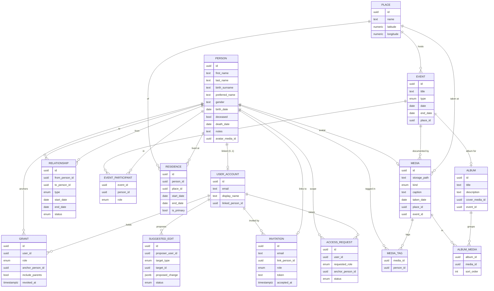

# Data Model — ERD

> Visual entity-relationship diagram for the full four-view vision. Status: 🟢 validated (2026-07-02). Entities:
> [[entity-person]], [[entity-relationship]], [[entity-event]], [[entity-place]], [[entity-media]],
> [[entity-user-account]]. Patterns: [[_patterns]]. Auth entities (Grant/Invitation/Branch) are
> stubbed pending [Stage 4](../04-architecture/decisions.md).

## View → entity coverage (stress test)

| View | Reads primarily |
|---|---|
| **Graph** | Person + Relationship |
| **Timeline** | Event + EventParticipant (+ relationship dates, residence dates) |
| **Map** | Place + Residence (current = null `end_date`) + Event place |
| **Gallery** | Media + MediaTag + Album/AlbumMedia (filter by person/event/place or browse albums) |

No orphaned entities; every view maps to entities. Circular dependency check: `Person.avatar_media_id`
→ Media → `MediaTag`/`event`/`place` → Person is a soft cycle resolved by nullable FKs (avatar set
after upload).
